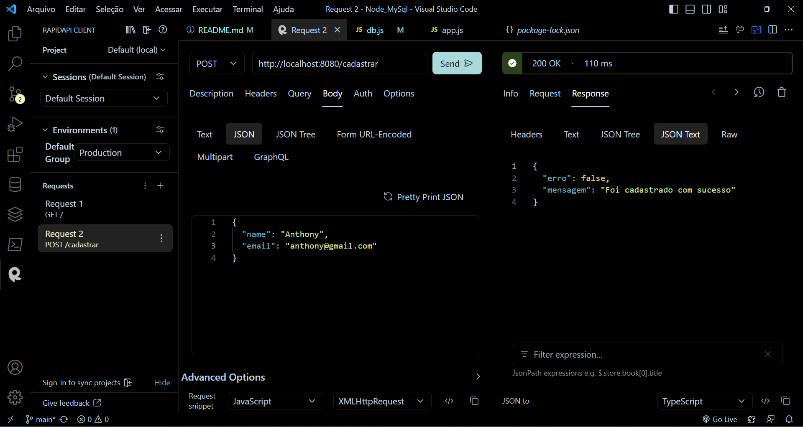

# NodeMySql


_*Esse conteudo foi produzido com base no video [Como conectar Node.js com MySQL e cadastrar no banco de dados](https://www.youtube.com/watch?v=_OeuPAb9bhU)_

Esse tutorial foi feito por um iniciante em desenvolvimento, inclusive em database e node.js.
Porém espero que sirva para um começo.
A principal função seria de como inserir dados em uma database em MySql.

Primeiro eu te mostrarei como preparar totalmente todo o ambiente.

Para mexer com todos os códigos eu utilizei o Visual Studio Code, e recomendo que se estiver seguindo o tutorial utilize o mesmo editor.\
[Link para baixar o Visual Studio Code](https://code.visualstudio.com/download):
Isso gerará um arquivo .exe, e basta executa-lo

Para isso também é necessario instalar o Node.Js.
Que pode ser instalado por aqui\
[Link para baixar o Node.Js](https://nodejs.org/pt-br/download):
Isso gerará um arquivo .exe, e basta executa-lo

Como usará o MySql como database precisará instalar o mesmo, você pode usar tanto o workbench quanto o cmd do MySql.\
[Link para baixar o MySql](https://dev.mysql.com/downloads/installer/):
Neste site terá duas opções, escolha a que tem maior tamanho de armazenamento, no caso a segunda opção.
Após isso você executa o arquivo .exe que vc baixou e será instalado o "MySql Installer - Commuinity", um "gerenciador", onde você pode instalar o workbench e também o mysql server, é importante definir uma senha ao instalar o mysql server, e caso queira manipular o database por cmd terá de instalar o mysql shell também.


Após isso podemos dar inicio, crie uma pasta em algum lugar em seu computador e abra a mesma pasta no VsCode.

Agora com a pasta aberta no VsCode abra um terminal.
```
Ctrl + Shift + '
```

e digite o seguinte comando.

```
npm init
```

Após isso deverá ser iniciado um donwload, e haverá algumas perguntas como nome, descrição e etc sobre o projeto, você pode dar enter em todas as perguntas, após isso deve ser gerado uma pasta chamada `node_modules` onde haverá alguns modulos haverá um arquivo chamado package.json e um package-lock.json .

após isso crie um arquivo chamado main.js, que será teu arquivo principal, onde estará a base para o seu site.

Agora instalaremos as dependencias para que nosso programa funcione, o express, o sequelize, o nodemon e o mysql2.

Digite este código :
```
npm install --save express
```
Espere, e digite: 
```
npm install --save nodemon
```
Espere, e digite: 
```
npm install --save sequelize
```
E por ultimo digite:
```
npm install --save mysql2
```

Apenas confira que seu package.json está assim:


Pronto, seu ambiente está pronto e agora iremos começar nosso programa

Abra seu arquivo main.js e insira isto:

```
const express = require("express");
const app = express();
```

Na "const express = require("express");", você irá requerer o pacote express que você instalou.
E "const app = express();" você usará o express.
Defina também com "app.use(express.json());" para que quando você for registrar dado ele registre no formato JSON.
Defina o metodo get usando o get, e defina a porta onde rodará o programa:
```
app.get("/", async (req, res) => {
    res.send("Metodo Get Funcionando Com Sucesso")
})

app.listen(8080, () => {
    console.log("Programa Funcionando Com Sucesso")
})
```
Agora no terminal que você abriu anteriormente digite "nodemon main.js".
E depois acesse no seu navegador o seguinte endereço: "localhost://8080".\
OBS: Você pode mudar a porta de 8080 para a que desejar.
Deverá abrir corretamente exibindo o que foi definido no console.log.


Agora você deve criar o banco de dados mysql, é muito simples tanto pelo workbench quanto pelo cmd, basta pesquisar.\
OBS: É importante ter instalado o MySql Server, já que ele realiza a conexão, caso não seja instalado não funcionará.
Recomendo que crie o banco com o nome "resgistroscomnode" e também defina para que o banco use as formatações de "UTF-8", para que acentos e caracteres especiais sejam possíveis em registros.
Fique tranquilo, ainda não será necessário criar uma tabela.

Agora iremos nos conectar ao banco, crie uma pasta chamada models, e dentro da pasta crie um arquivo chamado "db.js", e digite esta estrutura.

```
//Aqui você requere o sequelize.

const Sequelize  = require("sequelize")

//Aqui você efetua a conexão em si, "resgistroscomnode" é o nome do banco que foi criado, root é o usuário padrão do MySql, e o terceiro campo será a senha que você definiu ao instalar o MySqlServer, em seguida você define que usará o localhost e o mysql

const conexao = new Sequelize("resgistroscomnode", "root", "********", {
    host: "localhost",
    dialect: "mysql"
});

//Aqui você cria uma autenticação para ver se a conexão foi efetuada, caso "Conexão Efetuada Com Sucesso" seja exibida no terminal quer dizer a conexão deu problema.

conexao.authenticate()
.then(function(){
console.log("Conexão Efetuada Com Sucesso")
}).catch(function(){
    console.log("ERRO: Conexão Não Efetuada Com Sucesso")
})

//E aqui você exporta conexão.

module.exports = conexao
```

Pronto, agora estamos conectados ao banco e aprenderemos a inserir dados neste banco por fora dele.

Recomendo que você use a extensão "Rapid API Client" com ela conseguimos fazer Get, Post, Update e etc por dentro do VsCode, mas você pode optar por usar outro programa para isso como o "PostMan" ou "Insomnia".

Agora abra a pasta models e crie um novo arquivo chamado "users.js", que será onde você criará a tabela do seu banco, o codigó deste arquivo é assim:

```
Aqui você exporta o "Sequelize" e o seu arquivo "db.js".

const Sequelize = require("sequelize")
const db = require("./db");

Após isso você definirá campos e nome da tabela a ser inserida no seu banco,
"users" nó codigo será o nome da tabela, e pode ser mudada.
Você definirá campos como nome e email, o id é gerado automaticamente pelo MySql, porém é bom definir para que ele seja do tipo número inteiro, será autoincrementado e não pode ser nulo.
Nome e email são strings não nulas, você pode inserir varios outros campos como genero, profissao, idade, data de nascimento e até senha, porém caso queira fazer um sistema de login a interação com a senha deverá ser mais detalhada e deve envolver verificações a mais.

const User = db.define("users", {
    id: {
        type: Sequelize.INTEGER,
        autoIncrement: true,
        allowNull: false,
        primaryKey: true
    },
    name:{
        type: Sequelize.STRING ,
        allowNull: false
    },
    email:{
        type: Sequelize.STRING ,
        allowNull: false
    }
})


User.sync()

//Aqui você exporta a const User

module.exports = User
```

Depois disso a tabela já deve estar criada, caso você tenha parado o "nodemon main.js" execute o mesmo comando novamente para darmos continuidade.

Volte ao seu main.js e insira a sequinte const para pegar essa forma de registrar para usarmos no POST.

```
//Const que requere o metodo de usuário.
const User = require("./models/users")
```

E adicione este metodo ao seu main.js

```
//Definimos o metodo cadastrar, o que resultará que para acessa-lo seja necessário digitar "localhost://8080/cadastrar"

app.post("/cadastrar", async (req, res) => {
    console.log(req.body)

//await significa esperar, então esperaremos User ser criado e verificaremos se o usuário foi cadastrado ou não.

    await User.create(req.body)
        .then(() => {
            return res.json({
                erro: false,
                mensagem: "Foi cadastrado com sucesso"
            })
        }).catch(() => {
            return res.status(400).json({
                erro: true,
                mensagem: "Não foi cadastrado com sucesso"
            })
        })
})
```

Chegamos a parte final, nos registrarmos no banco.
Abra a extensão "Rapid API Client".
Defina o metodo como post e deixe como está na imagem abaixo.

Se preferir coloque seu nome e seu email, e aperte em send, se a resposta for como na imagem parabéns até aqui deu certo, agora abra sua forma de ver o MySql e seus databases, depois va no banco definido, na tabela de um refresh, se o dado inserido estiver lá, levante e saia pulando, "pelo menos foi o que eu fiz"
.

Este tutorial é muito básico, pois foi feito por um estudadante do 1º ano do Ensino Médio e que está no meio do primeiro ano fazendo um curso técnico de informática para internet pelo [Instituto Federal Catarinense Campus Araquari](https://araquari.ifc.edu.br/).
É possível que esse tutorial seja atualizado, mostrando como fazer o método GET, UPDATE, DELETE, fazer verificações, login, registro com inputs e etc, digamos que esta seja a versão 1.0, espera a 2.0, 3.0, 39.9.1 e por assim vai.
Obrigado por chegar até aqui.
